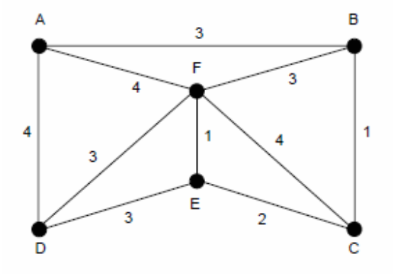

# DZ12

Za graf sa slike pronaći najkraće putove od čvora A do svih ostalih čvorova u grafu. Graf se učitava iz fajla u kome prva linija sadži broj čvorova i broj grana u grafu, a svaka naredna linija sadrži uređene trojke (u,v,w), gde u i v predstavlja granu između ta dva čvora, a w težine. Program treba da štampa svaki prolaz, do konačnog rešenja.

